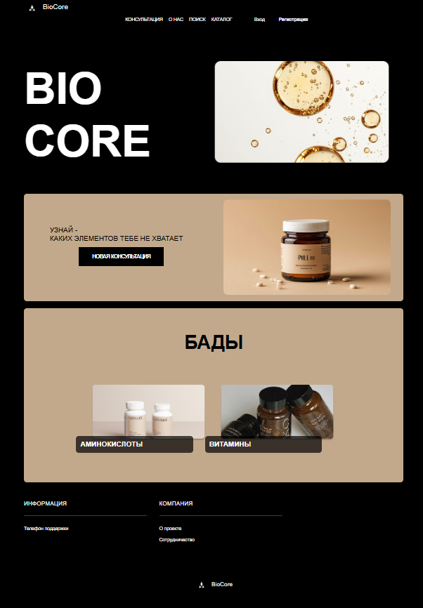
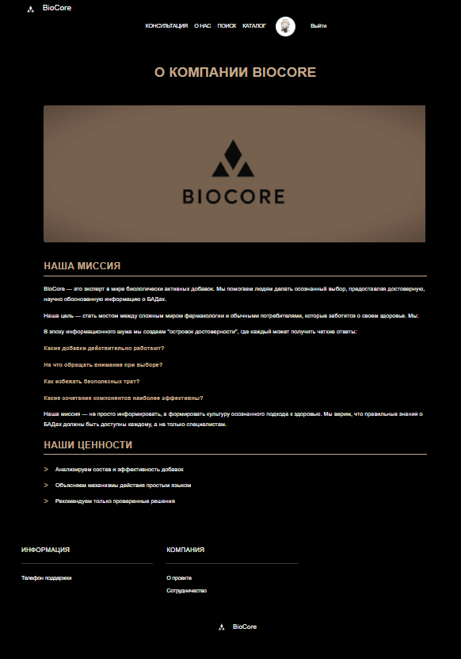
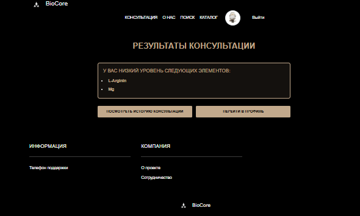
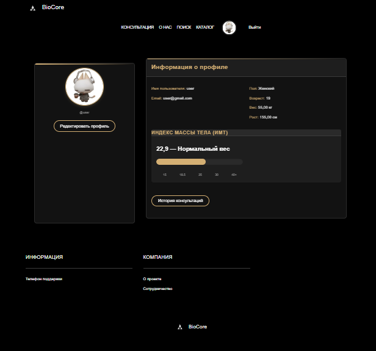
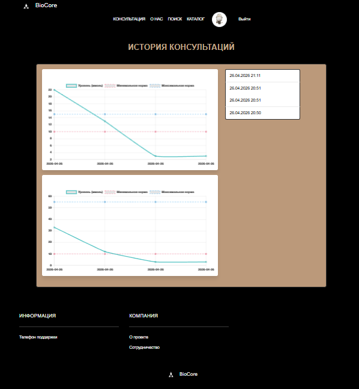

# BioCore — платформа рекомендаций витаминов и БАДов

Веб-приложение для подбора витаминов и БАДов на основе анализов пользователя.  
Проект разработан в рамках учебной практики в колледже (2025).

---

## О проекте

BioCore — это платформа, которая помогает пользователям получать рекомендации по витаминам и биологически активным добавкам на основе их анализов.

Пользователь загружает показатели (магний, аргинин  и др.), после чего система формирует консультацию с рекомендациями и ссылками на продукты из аптек и официальных магазинов.

⚠️ Платформа не продаёт препараты и не является медицинским сервисом — она носит рекомендательный характер.

## Идея проекта

Проект решает проблему самостоятельного анализа медицинских показателей пользователями.  
Вместо ручного поиска информации пользователь получает структурированные рекомендации на основе введённых данных.

---
## Экраны приложения. Примеры






---

## Функционал

### Пользователь:
- регистрация и авторизация
- редактирование профиля
- загрузка результатов анализов
- получение рекомендаций по витаминам и БАДам
- просмотр истории консультаций
- поиск и просмотр каталога элементов

### Администратор (встроенная админ-панель Django):
- управление пользователями
- управление элементами (витамины, БАДы)
- управление категориями и контентом

---

## Технологии

- **Backend:** Django
- **База данных:** SQLite
- **Кэширование:** Redis
- **Frontend:** HTML, CSS (Bootstrap)
- **Дополнительно:**
  - django-debug-toolbar
  - django-redis

---

## Моя роль в проекте

В рамках командной разработки я занималась:

- проектированием и реализацией backend-логики
- разработкой моделей и структуры базы данных
- настройкой и интеграцией Redis для кэширования и сессий
- реализацией логики рекомендаций
- работой с формами и обработкой пользовательских данных
- настройкой Django-проекта и его компонентов

---

## Что решает проект

- упрощает интерпретацию анализов для пользователей  
- снижает необходимость самостоятельного поиска информации  
- предоставляет удобный интерфейс для получения рекомендаций
- позволяет отслеживать динамику изменений результатов анализов 

---

## Чему я научилась

В ходе разработки проекта я:

- углубила знания Django (ORM, архитектура, apps)
- научилась проектировать структуру базы данных
- разобралась с кэшированием и Redis
- работала с пользовательскими формами и валидацией
- улучшила понимание архитектуры backend-приложений
- получила опыт командной разработки

---

## Структура проекта

```
biocore/
├── biocore_site/
│ ├── bio_core_website/ # основное приложение
│ ├── users/ # приложение пользователей
│ ├── media/ # загруженные файлы
│ ├── db.sqlite3
│ └── manage.py
├── venv/
├── requirements.txt
└── README.md
```

---

## ⚙️ Установка и запуск

### 1. Клонирование проекта

```
git clone https://github.com/Kirikiri2/bio_core biocore
cd biocore
```
2. Создание виртуального окружения

❗ Рекомендуется Python 3.12
```
py -3.12 -m venv venv
venv\Scripts\activate
```
3. Установка зависимостей
```
pip install -r requirements.txt
```
4. Запуск Redis (обязательно)
```
docker run -d -p 6379:6379 --name redis-server redis
```

Проверка:
```
docker ps
```
5. Переход в проект
```
cd biocore_site
```
6. Применение миграций
```
python manage.py migrate
```
7. Создание суперпользователя
```
python manage.py createsuperuser
```
8. Запуск сервера
```
python manage.py runserver
```
9. Сайт доступен в браузере по ссылке:
```
http://127.0.0.1:8000/
```
**⚠️ Важно**
Для работы проекта необходим запущенный Redis (порт 6379)
Использование Python 3.14 может вызывать ошибки с зависимостями
Debug Toolbar включён только в режиме DEBUG
